# PANW032
<p></p>

## Welcome

This workshop will demonstrate how to leverage infrastructure as code (IaC) and DevSecOps patterns to automate, scale, and improve the security posture of cloud infrastructure and applications. We will create a pipeline that ensures our configurations are secure and compliant from code to cloud.

This guide provides step-by-step instructions to integrate **Cortex Cloud** (and **checkov**) with **Terraform Cloud, GitHub, VScode** and **GCP**. 


## Learning Objectives
- Gain an understanding of DevSecOps and infrastructure as code (IaC) using Terraform
- Scan IaC files for misconfigurations locally
- Set up CI/CD pipelines to automate security scanning and policy enforcement
- Fix security findings and GCP resource misconfigurations with Cortex Cloud

**Let’s start with a few core concepts...**

## DevSecOps
The foundation of DevSecOps lies in the DevOps movement, wherein development and operations functions have merged to make deployments faster, safer, and more repeatable. Common DevOps practices include automated infrastructure build pipelines (CI/CD) and version-controlled manifests (GitOps) to make it easier to control cloud deployments. By baking software and infrastructure quality requirements into the release lifecycle, teams save time manually reviewing code, letting teams focus on shipping features.

As deployments to production speed up, however, many traditional cloud security concepts break down. With the rise of containerized technologies, serverless functions, and IaC frameworks, it is increasingly harder to maintain visibility of cloud security posture. 

By leveraging DevOps foundations, security and development teams can build security scanning and policy enforcement into automated pipelines. The ultimate goal with DevSecOps is to “shift cloud security left.” That means automating it and embedding it earlier into the development lifecycle so that actions can be taken earlier. Preventing risky deployments is a more proactive approach to traditional cloud security that often slows down development teams with deployment rollbacks and disruptive fixes.

For DevSecOps to be successful for teams working to build and secure infrastructure, embracing existing tools and workflows is critical. At Palo Alto Networks, we’re committed to making it as simple, effective, and painless as possible to automate security controls and integrate them seamlessly into standard workflows.

### Setup & requirements

<p>To complete the lab, you will need:
<ul>
<li>An internet browser, preferably <a href="https://www.google.com/chrome/dr/download/">Google Chrome</a>.</li>
</ul>
</p>

<ql-warningbox>
<b>
- Labs cannot be paused.<br>
- If you click <code>End Lab</code> the lab environment is deleted.<br>
- You can end the lab and start it again later, but your progress will not be saved.<br></b>
</ql-warningbox>

### Start the lab

1. When you are ready, click the **Start Lab** button.
    

    <ql-infobox>
    The lab will take several minutes to provision. Once the completed, you can log into the lab's Google Cloud console.       
    </ql-infobox>
    </br>

2. Right-click **Console → Open Link in Incognito Window**. Use the credentials below to log into the Google Cloud console.

    

    | Credentials  | Value                 |
    | ------------ | --------------------- |
    | **Username** | {{{user_0.username}}} |
    | **Password** | {{{user_0.password}}} |

    <ql-warningbox>
    It is highly recommended to open the cloud console in a browser with Incognito Mode enabled.  This avoids potentially working within a personal or corporate cloud account. 
    </ql-warningbox>
    </br>

3. Accept the EULA agreements to finish signing in.
    

---


## Infrastructure as Code Using Terraform
Infrastructure as code (IaC) frameworks, such as  HashiCorp Terraform, make cloud provisioning scalable and straightforward by leveraging automation and code. Defining our cloud infrastructure in code simplifies repetitive DevOps tasks and gives us a versioned, auditable source of truth for the state of an environment.

Terraform is useful for defining resource configurations and interacting with APIs in a codified, stateful manor. Any updates we want to make, such as adding more instances, or changes to a configuration, can be handled by Terraform. 

After performing `terraform init`, we can provision resources with the following command:

```bash
terraform apply
```

Any changes made to the resource definition within a .tf file, such as adding tags or changing the acl, can be pushed with the  `terraform apply` command. 

Another benefit of using Terraform to define infrastructure is that code can be scanned for  misconfigurations before the resource is created. This allows for security controls to be integrated into the development process, preventing issues from ever being introduced, deployed and exploited.

## Section 0: Setup Dev Environment

1. Click **Activate Cloud Shell** at the top of the Google Cloud console. 
   
   
Before installing checkov or pulling code to scan, create and activate a python virtual environment to better organize python packages.

``` 
python3 -m venv env
source ./env/bin/activate 
```

##
## Section 1: Code Scanning with checkov

[Checkov](https://checkov.io) is an open source 'policy-as-code' tool that scans cloud infrastructure defintions to find misconfigurations before they are deployed. Some of the key benefits of checkov:
1. Runs as a command line interface (CLI) tool 
2. Supports many common plaftorms and frameworks 
3. Ships with thousands of default policies
4. Works on windows/mac/linux (any system with python installed)

## Install checkov

To get started, install checkov using pip:

```
pip3 install checkov
```

Use the `--version` and `--help` flags to verify the install and view usage / optional arguements.

```
checkov --version
checkov --help
```


To see a list of every policy that checkov can enforce, use the `-l` or ` --list` options.

```
checkov --list
```

Now that you see what checkov can do, let's get some code to scan...


## Fork and clone target repository
This workshop involves code that is vulnerable-by-design. All of the necessary code is contained within [this repository](https://GitHub.com/paloAltoNetworks/cortex-cloud-devsecops-workshop) or workshop guide itself.

To begin, log into GitHub and navigate to the [Cortex Cloud DevSecOps Workshop](https://GitHub.com/paloAltoNetworks/cortex-cloud-devsecops-workshop) repository. Create a `Fork` of this repository to create a copy of the code in your own account.


Ensure the selected `Owner` matches your username, then proceed to fork the repository by clicking `Create fork`.

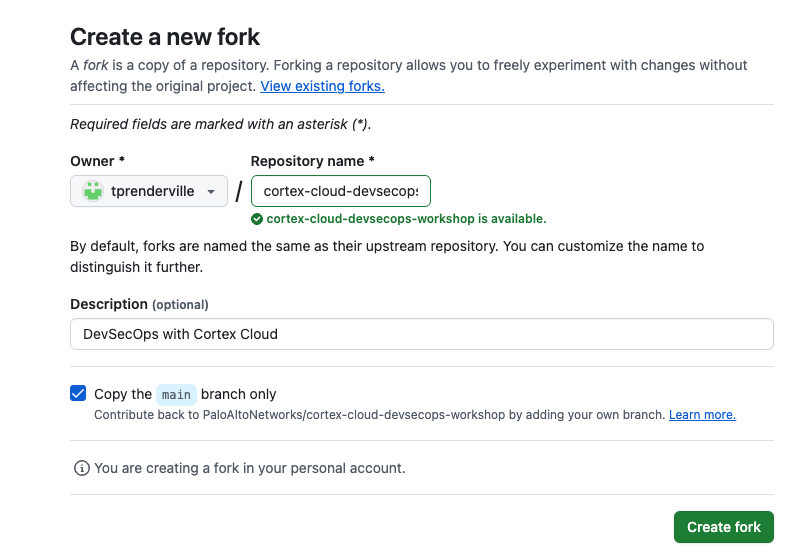

Grab the repo URL from GitHub, then clone the **forked** repository to Cloud9.


```
git clone https://github.com/<your-organization>/cortex-cloud-devsecops-workshop.git
cd cortex-cloud-devsecops-workshop/
git status

```


Great! Now we have some code to scan. Let's jump in...


## Scan with checkov

Checkov can be configured to scan files and enforce policies in many different ways. To highlight a few: 
1. Scans can run on individual files or entire directories. 
2. Policies can be selected through selection or omission. 
3. Enforcement can be determined by flags that control checkov's exit code.


Let's start by scanning the entire `./code` directory and viewing the results.

```
cd code/
checkov -d .
```


Failed checks are returned containing the offending file and resource, the lines of code that triggered the policy, and a guide to fix the issue.


Now try running checkov on an individual file with `checkov -f <filename>`. 

```
checkov -f deployment_gce.tf
```
```
checkov -f vertex.tf
```

Policies can be optionally enforced or skipped with the `--check` and `--skip-check` flags. 

```
checkov -f deployment_gce.tf --check CKV_GCP_39,CKV_GCP_3
```
```
checkov -f deployment_gce.tf --skip-check CKV_GCP_39,CKV_GCP_3
```

Frameworks can also be selected or omitted for a particular scan.


```
checkov -d . --framework secrets --enable-secret-scan-all-files
```
```
checkov -d . --skip-framework dockerfile
```


Lastly, enforcement can be more granularly controlled by using the `--soft-fail` option. Applying `--soft-fail` results in the scan always returning a 0 exit code. Using `--hard-fail-on` overrides this option. 

Check the exit code when running `checkov -d . ` with and without the `--soft-fail` option.

```
checkov -d . ; echo $?
```
```
checkov -d . --soft-fail ; echo $?
```


## Integrate with GitHub Actions
Now that we are more familiar with some of checkov's basic functionality, let's see what it can do when integrated with other tools like GitHub Actions.

You can leverage GitHub Actions to run automated scans for every build or specific builds, such as the ones that merge into the master branch. This action can alert on misconfigurations, or block code from being merged if certain policies are violated. Results can also be sent to Cortex Cloud and other sources for further review and remediation steps.

Let's begin by setting an action from the repository page, under the `Actions` tab. Then click on `set up a workflow yourself ->` to create a new action from scratch.


Name the file `checkov.yaml` and add the following code snippet into the editor.

```yaml
name: checkov
on:
  pull_request:
  push:
    branches:
      - main    
jobs:
  scan:
    runs-on: ubuntu-latest 
    permissions:
      contents: read # for actions/checkout to fetch code
      security-events: write # for GitHub/codeql-action/upload-sarif to upload SARIF results
     
    steps:
    - uses: actions/checkout@v2
    
    - name: Run checkov 
      id: checkov
      uses: bridgecrewio/checkov-action@master
      with:
        directory: code/
        #soft_fail: true
        
    - name: Upload SARIF file
      uses: GitHub/codeql-action/upload-sarif@v3
      
      # Results are generated only on a success or failure
      # this is required since GitHub by default won't run the next step
      # when the previous one has failed. Alternatively, enable soft_fail in checkov action.
      if: success() || failure()
      with:
        sarif_file: results.sarif
```

Once complete, click `Commit changes...` at the top right, then select `commit directly to the main branch` and click `Commit changes`.


Verify that the action is running (or has run) by navigating back to the `Actions` tab.


> **⍰  Question** 
>
> The action will result in a "Failure" (❌) on the first run, why does this happen?


View the results of the run by clicking on the `Create checkov.yaml` link.


Notice the policy violations that were seen earlier in Cloudshell are now displayed here. However, this is not the only place they are sent...

## View results in GitHub Secuirty 
Checkov natively supports SARIF format and generates this output by default. GitHub Security accepts SARIF for uploading security issues. The GitHub Action created earlier handles the plumbing between the two.


Navigate to the `Security` tab in GitHub, the click `Code scanning` from the left sidebar or `View alerts` in the **Security overview > Code scanning alerts** section.


The security issues found by checkov are surfaced here for developers to get actionable feedback on the codebase they are working in without having to leave the platform. 


> [!TIP]
> Code scanning alerts can be integrated into many other tools and workflows.


## Integrate workflow with Terraform Cloud
Let's continue by integrating our GitHub repository with Terraform Cloud. We will then use Terraform Cloud to deploy IaC resource to GCP.

Navigate to [Terraform Cloud](app.terraform.io) and sign in / sign up. The community edition is all that is needed for this workshop.

Once logged in, follow the prompt to set up a new organization.


Enter an `Organization name` and provide your email address.


 

Create a workspace using the `Version Control Workflow` option.


Select `GitHub`, then `GitHub.com` from the dropdown. Authenticate and authorize the GitHub.


 

Choose the `cortex-cloud-devsecops-workshop` from the list of repositories.


Add a `Workspace Name` and click `Advanced options`.


 

In the `Terraform Working Directory` field, enter `/code/build/`. Select `Only trigger runs when files in specified paths change`.


Leave the rest of the options as default and click `Create`.


Almost done. In order to deploy resources to GCP, we need to provide Terraform Cloud with GCP credentials. We need to add our credentials as workspace variables. Click `Continue to workspace overview` to do continue. 

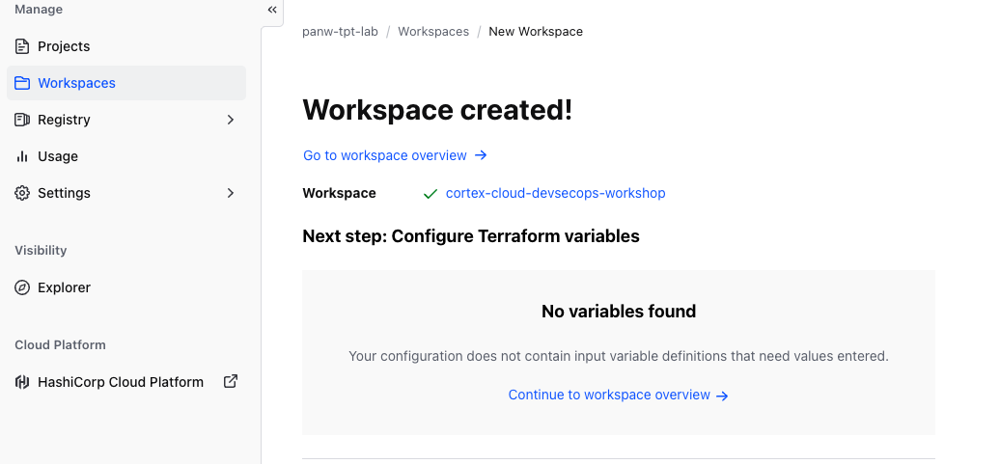

Click `Configure variables`


Add variable for `GOOGLE_CREDENTIALS` Ensure you select `Environment variables` and is marked as `Sensitive`.

<ql-infobox>
<b>
Terraform Cloud Variable only support in oneline value, for Google service account credentials JSON would need to convert into oneline format to meet the requirement. 
</b>
</ql-infobox>
<br>
</br>
In order to create and convert the JSON format into expected format, we need go through below steps. 

Go to Google Console, `IAM & Admin -> Service Accounts`, look for the service account start with `qwiklabs-gcp-******iam.gserviceaccount.com`.


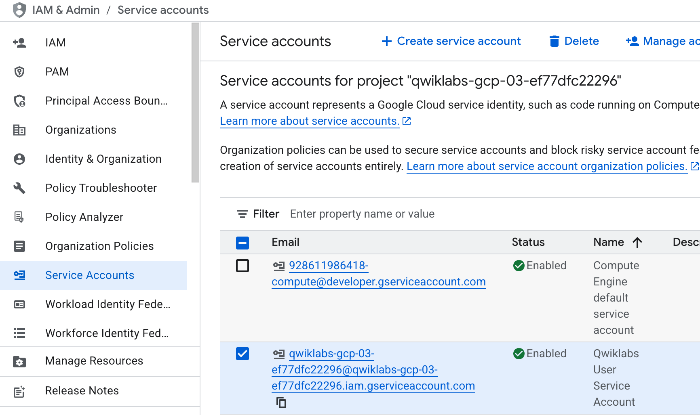

Click the Service Account and go the `Key` tab to create a new Key. Choose the `JSON` as the key format. It will be download to your local machine.

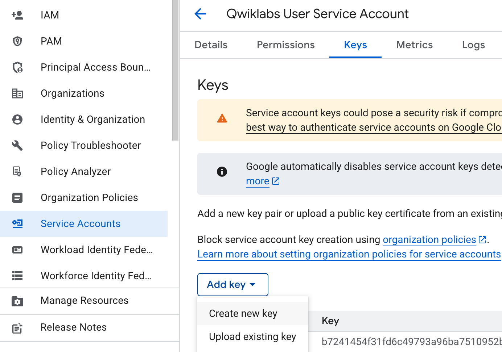
Go to Google Cloud Shell, run below command:
```sh
nano convert_gcp_key.sh
```
Paste below shell code 
```sh
#!/bin/bash

echo "Paste your GCP service account JSON content below."
echo "(When done, press Ctrl+D to finish input)"
echo

# Read multi-line input from stdin until EOF, then convert to single-line JSON
input=$(cat)
echo "$input" | jq -c .
```
Save the code, and add permission to the shell script and run it in the Cloudshell:
```sh
chmod +x convert_gcp_key.sh
./convert_gcp_key.sh
```

The instruction of the script wii be shown like below
```sh
Paste your GCP service account JSON content below.
(When done, press Ctrl+D to finish input)
```
Follow the instruction, open the JSON credential you download previously with any text editor, and copy the content and paste into the Cloudshell, and then press Ctrl+D to finish input.

The correct format of oneline credential will be shown in the Cloudshell output.
Copy the output and paste as the value of `GOOGLE_CREDENTIALS`

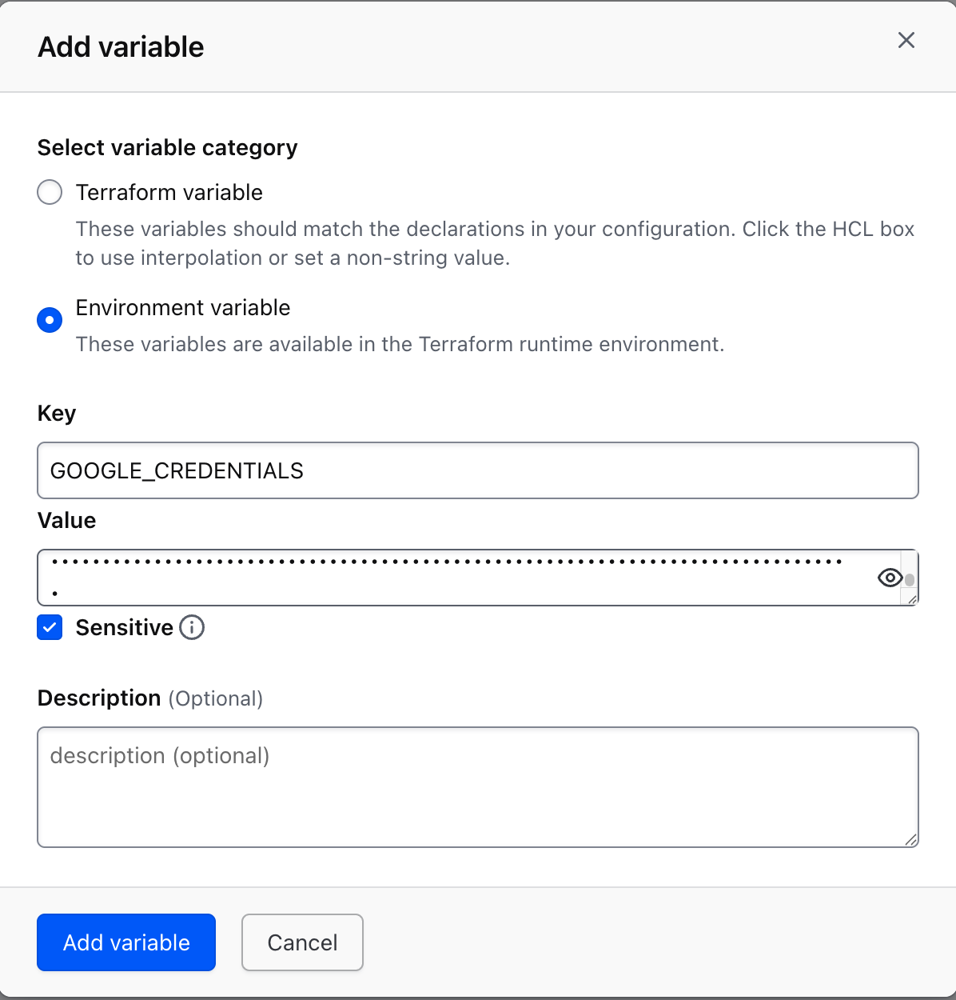

Review the variables then return the your workspace overview when finished.

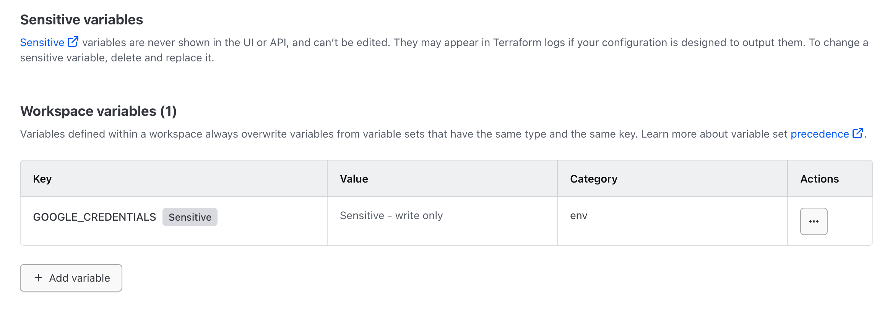

Terraform Cloud is now configured and our pipeline is ready to go. Let's test this out by submitting a pull request.

We have now configured a GitHub repository to integrate with Terraform Cloud to deploy infrastructure. Let's see how this works in action.

Create a new file in the GitHub UI under the path `code/build/gcs.tf`. Enter the following code snippet into the new file. 

<ql-code>
<ql-code-block language="terraform" tabTitle="Terraform" templated>
provider "google" {
  project = "{{{project_0.project_id|pending}}}"
  region  = "us-central1"
}

resource "google_storage_bucket" "example" {
  name          = "demo-${random_id.rand_suffix.hex}"
  location      = "us-central1"
  force_destroy = true

  uniform_bucket_level_access = false
  public_access_prevention = "enforced"
}

resource "random_id" "rand_suffix" {
  byte_length = 4
}

output "bucket_name" {
  value = google_storage_bucket.example.name
}
</ql-code-block>
</ql-code>


Once complete, click `Commit changes...` at the top right, then select `Create a new branch and start a pull request` and click `Propose changes`.

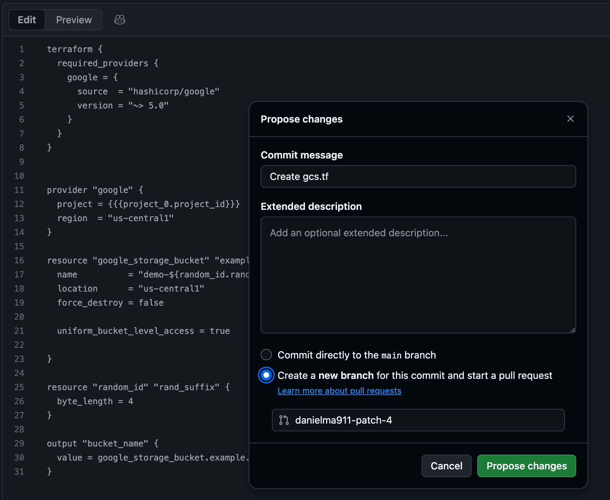

At the next screen, review the diff then click `Create pull request`.


One more time... click  `Create pull request` to open the PR.


Wait for the checks to run. Then take note of the result: Terraform Cloud has verified the new gcs.tf file.


You can click `Merge pull request` This will accept and close the pull request.


## Deploy to GCP
Navigate to Terraform Cloud and view the running plan.


Once finished, click `Confirm & apply` to deploy the gcs bucket to GCP.


Go to the GCS menu within GCP to view the bucket that has been deployed.


Now let's see how we can leverage Cortex Cloud to make this all easier, gain more featues and scale security at ease.

##
## Section 2: Application Security with Cortex Cloud
> [!NOTE]
> *This portion of the workshop is intended to be view-only. Those with existing access to Cortex Cloud can follow along but is not recommended to onboard any of the workshop content into a production deployment of Cortex Cloud. Use this guide as an example and the content within for demonstration purposes only.*

## Welcome to Cortex Cloud
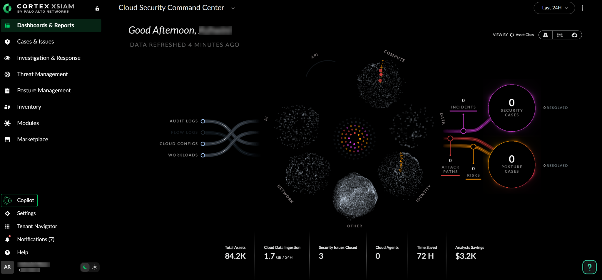

Cortex Cloud’s comprehensive security solution helps you take a platform-based, proactive approach to securing your cloud estate from Code to Cloud to SOC. It provides real-time cloud security that allows you to investigate and remediate your cloud security issues from a single platform with all the signals in a single data lake.

Cortex Cloud is an easily extensible platform to consolidate Application Security, Cloud Posture Security, Runtime Security, and Security Operations (SOC). It is enterprise-ready for regulated organizations with data residency preserving scanning worldwide. It provides consolidated and flexible reporting for executives and operators for all cloud security postures. It also includes an AI Copilot across the platform to simplify your day-to-day activities.
- Application Security: Prevent issues from getting into your production environment.

- Cloud Posture Security: Reduce and prioritize risks already present in your cloud environment.

- Cloud Runtime: Stop an attacker from exploiting risks present in your cloud environment.

- SOC: Detect and respond.
## Onboard GCP Account
> [!NOTE]
> Link to docs: [Onboard GCP Account](https://docs-cortex.paloaltonetworks.com/r/Cortex-CLOUD/Cortex-Cloud-Posture-Management-Documentation/Ingest-cloud-assets)

To begin securing resources running in the cloud, we need to configure Cortex Cloud to communitcate with a CSP. Let's do this by onboarding an GCP Account.

Navigate to **Settings > Data Sources > Cloud Servcie Provider > Google Cloud Platform(GCP)** and follow the instructions prompted by the conifguration wizard.

Choose **Project** for the scope, select **Cloud Scan** as the Scan Mode, leave the rest as default and click **Save**.
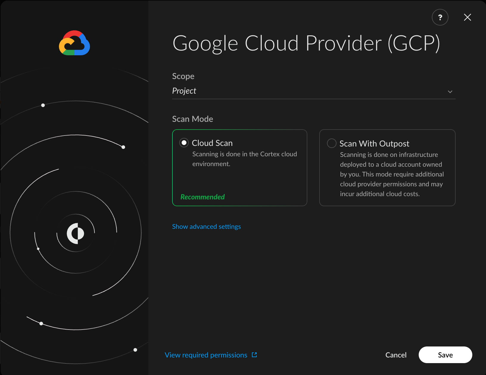

Click **Download Terraform**, an terraform template file will be download to your local machine.


<ql-infobox>
  Installed Terraform on your local machine (if you don't have it installed). You can download Terraform from the official Terraform [website](https://www.terraform.io/downloads.html) and follow the installation instructions for your operating system.
</ql-infobox>

Open your local terminal (Command prompt, PowerShell, or Terminal). Log in to your GCP account using the gcloud CLI:
```sh
gcloud auth login
```

Create a directory on your local machine to store and run the Terraform code. If you have more than one GCP connector, you need a separate directory for each one. Extract the Terraform files. Ensure all necessary Terraform files are present (main.tf, template_params.tfvars, etc).
```sh
mkdir -p ~/terraform/gcp-connector-1
cd ~/terraform/gcp-connector-1
tar -xzvf <your_template>.tar.gz
terraform init
```

Apply your Terraform configuration using the downloaded parameter file. When prompted, enter the project ID if you configured one in the onboarding wizard:
```sh
terraform apply --var-file=template_params.tfvars
```
The Terraform template is deployed. When the template is successfully uploaded to GCP, the initial discovery scan is started. When the scan is complete, you can view your cloud assets in **Asset Inventory**.

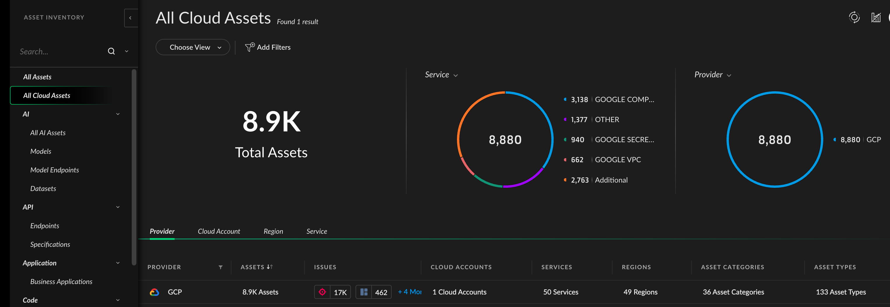

## Integrations and Providers
Cortex Cloud has a wide variety of built-in integrations to help operationalize within a cloud ecosystem.

Navigate to `Settings`, then select `Data Collection` from the left sidebar. 

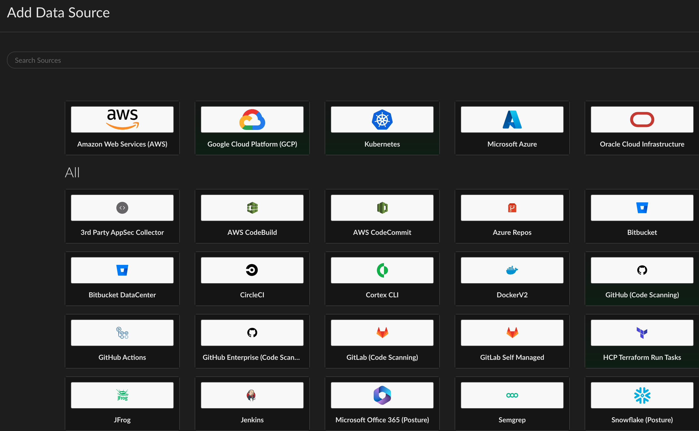

Notice all of the different tools that can be integrated natively.


## Terraform Cloud Run Tasks
> [!NOTE] 
> Link to docs: [Connect Terraform Cloud - Run Tasks](https://docs-cortex.paloaltonetworks.com/r/Cortex-CLOUD/Cortex-Cloud-Runtime-Security-Documentation/Onboard-Terraform-Cloud-Run-Tasks)

Let's now connect Cortex Cloud with Terraform Cloud using the Run Tasks integration. This allows for developers and platform teams to get immediate security feedback for every pipeline run. The Run Task integration will also surface results of every pipeline run to Cortex Cloud and the Security team.

First we need to create an API key in Terraform Cloud. Go to the Terraform Cloud console and navigate to **User Settings > Tokens** then click **Create an API Token**.


Name the token something meaningful, then click **Generate token**.


Copy the token and save the value somewhere safe. This will be provided to Cortex Cloud in the next step.

Go to the Cortex Cloud console and navigate to **Settings > Data Sources > HCP Terraform Run Tasks** to set up the integration. Click **+Add New Instance**


Enter the API token generated in Terraform Cloud and click **Next**.

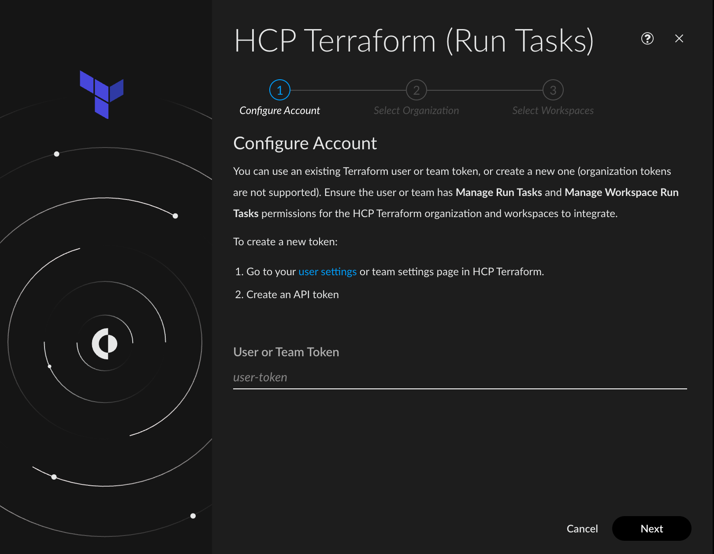

Select your **Organization**.


Select your **Workspace** and choose the **Run Stage** in which you want Cortex Cloud to execute a scan. `Pre-plan` will scan HCL code, `Post-plan` will scan the Terraform plan.out file.

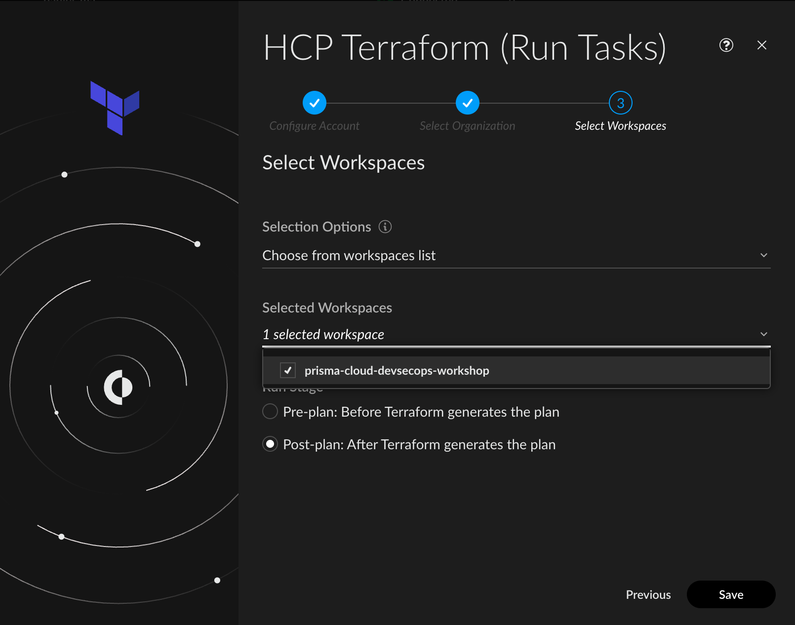


Once completed, click **Save**.

Return back to Terraform Cloud to view the integration. 


Go to your **Workspace** and click **Settings > Run Tasks**. 

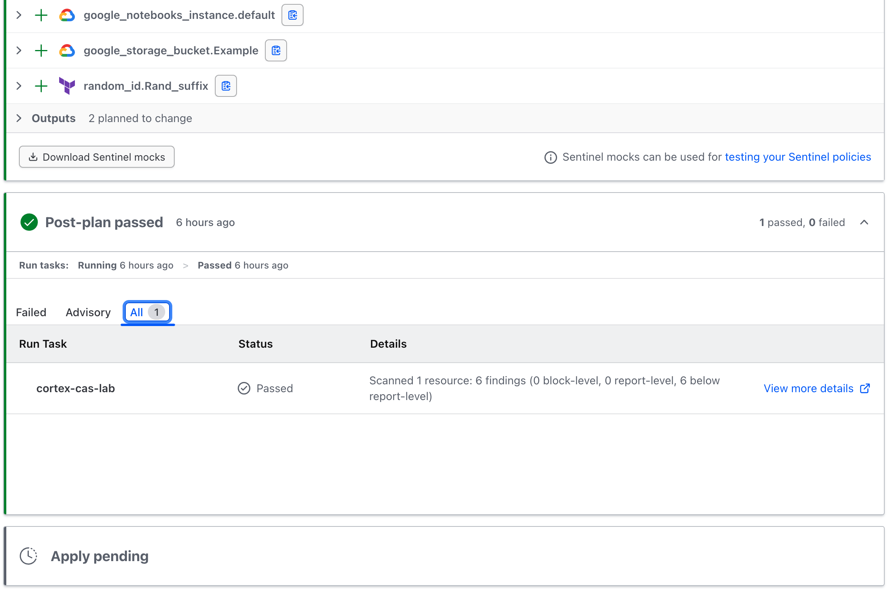


## GitHub Application
> [!NOTE] 
> Link to docs: [Connect GitHub](https://docs-cortex.paloaltonetworks.com/r/Cortex-CLOUD/Cortex-Cloud-Runtime-Security-Documentation/GitHub-Cloud)


Next we will set up the Cortex Cloud GitHub Application which will perform easy-to-configure code scanning for GitHub repos.

Go to Cortex Cloud and create a new integration under **Settings > Data Collection > Data Sources > GitHub Instances**.
Click **+ New Instance**


Follow the install wizard and **Authorize** your GitHub account.

Click Authorize, it will redirect to GitHub to install and authorize Application Secuirty on GitHub

Click **Authorize Cortex AppSec us**


Select the repositories you would like to provide access to and click **Install & Authorize**.


Select the target repositories to scan now accessible from the wizard, then click **Save**.


Click **Close** once completed. Navigate to **Inventory > Assets > Code > Repositories** to view the onboarded repo(s). 


Also navigate to **Modules > Application Security > Issues > IaC Misconfigurations** to view the results coming from the integration.


## Submit a Pull Request 2.0

Lets push a change to test the integration. Navigate to GitHub and make a change to the Google Storage Bucket resource deployed earlier under `code/build/gcs.tf`.


Add the comment out the line of code (**public_access_prevention = "enforced"**) to the Google Storage Bucket resource definition. Then click **Commit changes...** once complete. It should looks like below:

```
provider "google" {
  project = "qwiklabs-gcp-03-fa7edfd03d8e" ##the project id of you lab instance
  region  = "us-central1"
}

resource "google_storage_bucket" "sample" {
  name          = "demo2-${random_id.Rand_suffix.hex}"
  location      = "us-central1"
  force_destroy = true

  uniform_bucket_level_access = false

  #public_access_prevention = "enforced" ##comment out this line of code for demo
}

resource "random_id" "Rand_suffix" {
  byte_length = 4
}

output "Bucket_name" {
  value = google_storage_bucket.sample.name
}

```
Create a new branch and click **Propose changes**.
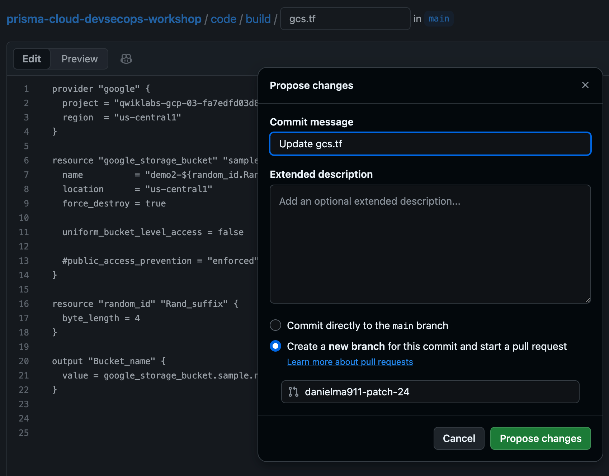


On the next page, review the diff then click **Create pull request**. Once gain, click **Create pull request** to open the pull request.

Let the checks run against the pull request. Cortex Cloud can review pull requests and will add comments with proposed changes to give developers actionable feedback within their VCS platform. You can click **Commit suggestion** and **commit changes** directly in the Github. We will not do this here, and will initiate a PR request in the Cortex Cloud later.

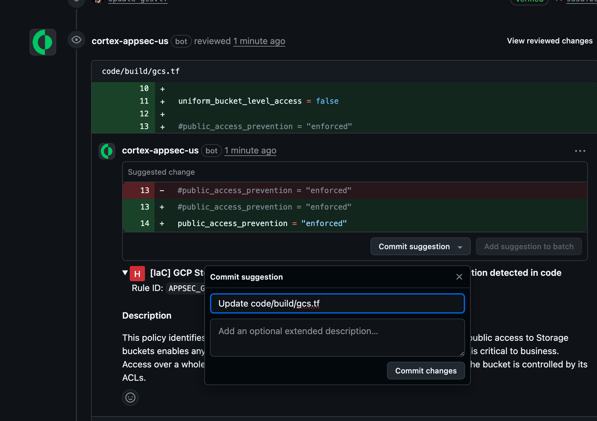


 When ready, select **Merge without waiting for requirements to be Met (bypass rules)** click **Bypass rules and merge** to merge the PR.


Now that the change has been merged, navigate back to Terraform Cloud to view the pipeline running.

Check the **Pre-plan** stage and view the results of the Cortex Cloud scan.
**Placeholder**
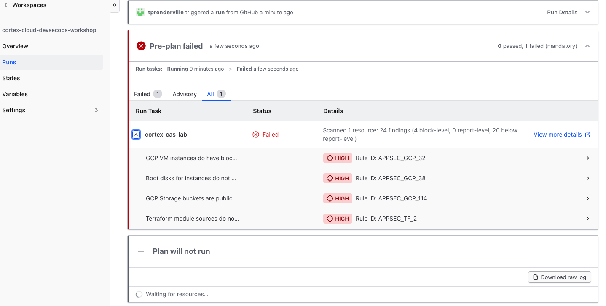

Leave this as is for now. We will soon fix the error and retrigger the pipeline.


## View scan results in Cortex Cloud
Return to Cortex Cloud to view the results of all the scans that were just performed.

Navigate to **Modules > Application Security > Scans > Pull Request Scans** to view findings for all scans. You can find the PR request security check has been failed.


Click it and you will see the Overview of the Pull Request Scan.


Click the **Configurations** Tab, you will see the Issues:

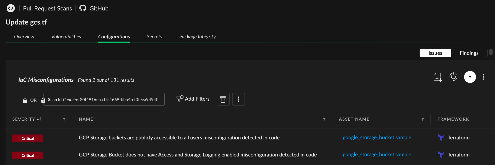


Click the issue **GCP Storage buckets are publicly accessible to all users misconfiguration detected in code** to get the details. 

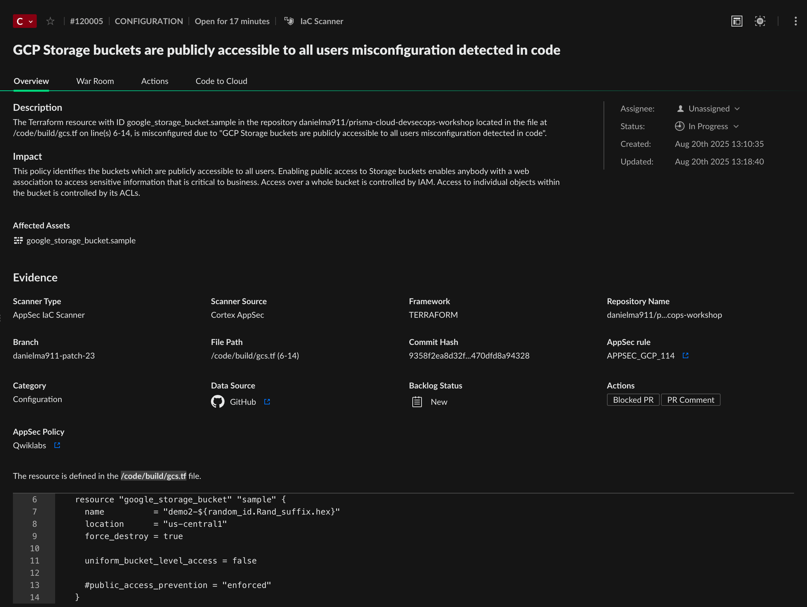


## Issue a PR-Fix
Lets create a pull request from the Cortex Cloud console to apply a code fix. 
Click the three dots at the top right. And Click **Open fix pull request**
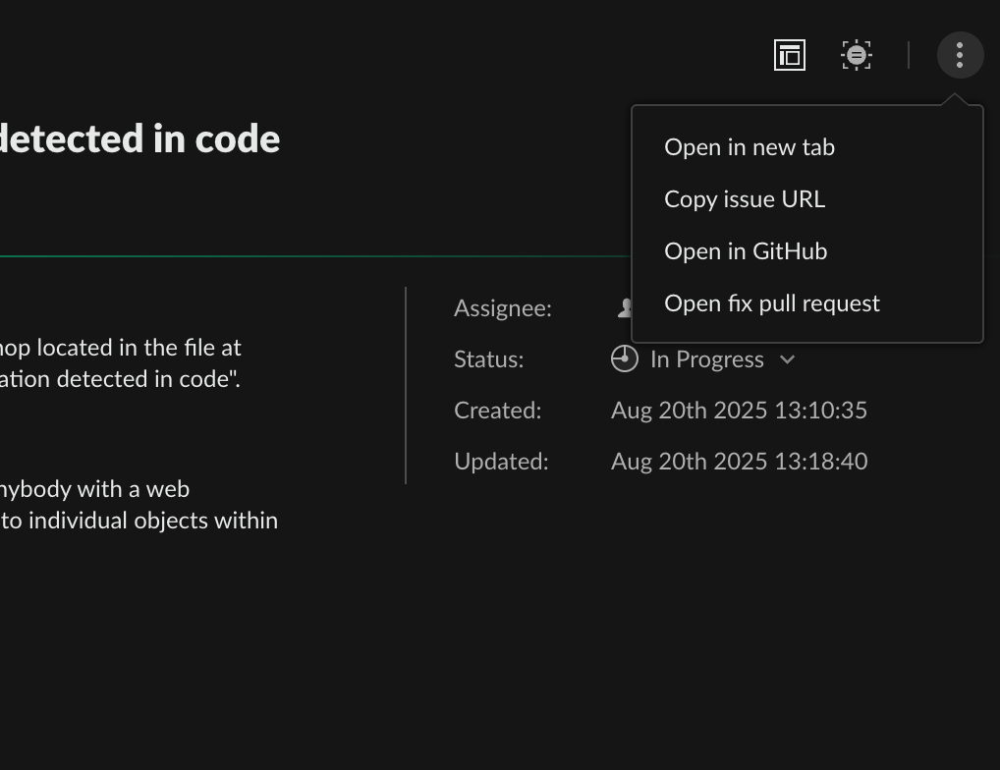

Wait a while a Pull Request will be generated to you Github Repo. Navigate back to GitHub and check the **Pull request** tab to see the fix Cortex Cloud submitted.


Drill into the pull request and inspect the file changes under the **Files changes** tab. Notice the changes made to remediate the original policy violation.

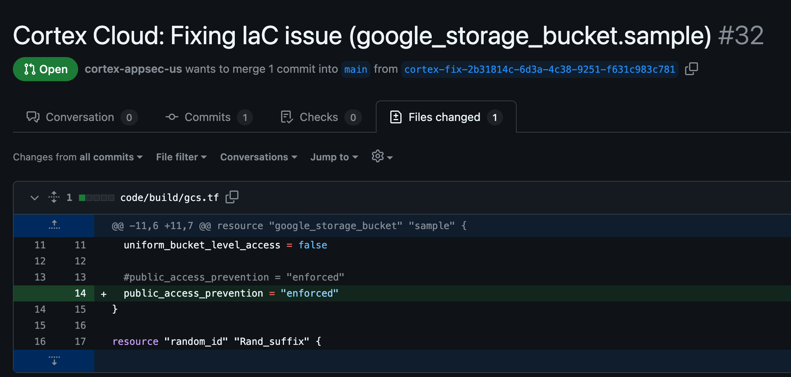

Go back to the **Coversation** tab and click **Merge the pull request** at the bottom to check this code into the main branch.

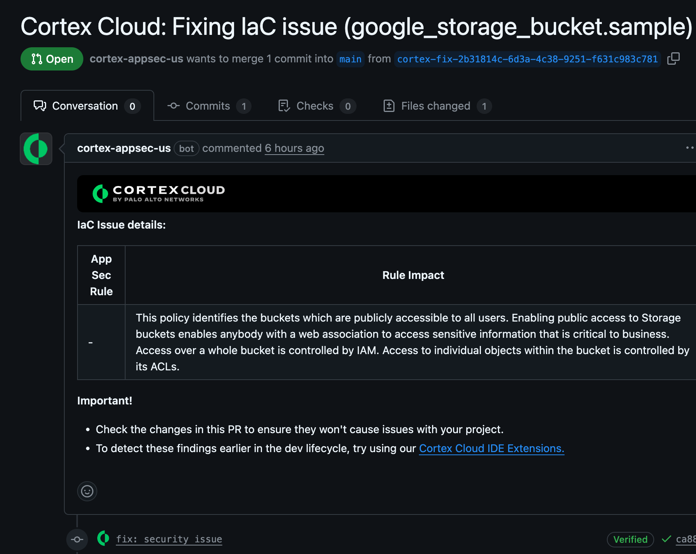

Check Terraform Cloud to view the plan succesfully run. No need to apply this run.

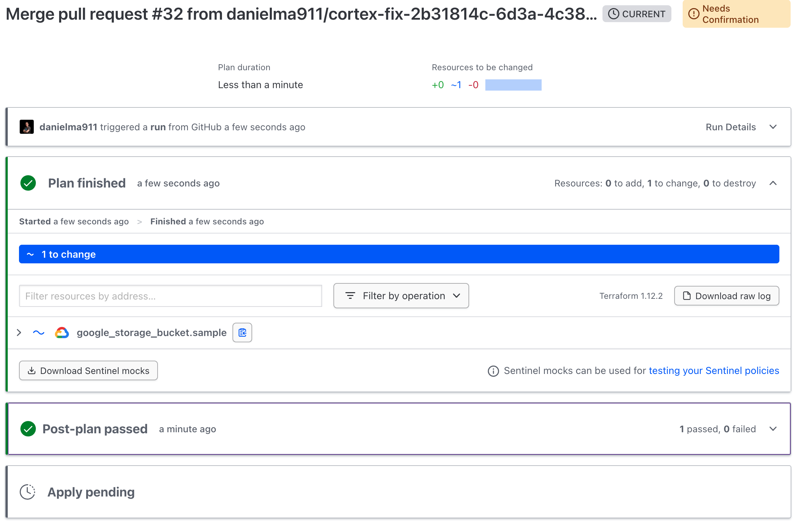


## Wrapping Up
Congrats! In this workshop, we didn’t just learn how to identify and automate fixing misconfigurations — we learned how to bridge the gaps between Development, DevOps, and Cloud Security. We are now equipped with full visibility, guardrails, and remediation capabilities across the development lifecycle. We also learned how important and easy it is to make security accessible to our engineering teams.

Try more of the integrations with other popular developer and DevOps tools. Share what you’ve found with other members of your team and show how easy it is to incorporate this into their development processes. 

You can also check out the [Cortex Cloud DevDay](https://register.paloaltonetworks.com/securitydevdays) to experience more of the platform in action.
